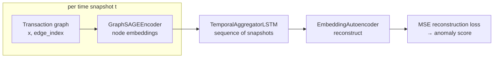

# CTD Scholars — Graph Neural Networks for Fintech Transaction Networks

<p>
  
  
  
  
  
</p>

Research playground for **spatio-temporal graph modeling** on **payment-like transaction graphs**.
The codebase builds dynamic user–user graphs (P2P, top-up, withdrawal) and trains a
**GraphSAGE + LSTM + autoencoder** stack (`ST_GAD_Model`) for representation learning and
reconstruction-based anomaly scoring.

---

## Why this project exists

- **Product angle:** financial networks are inherently relational (users, counterparties, amounts,
  time). Graph ML is a natural lens for risk, fraud patterns, and behavioral segmentation — beyond flat
  tabular features.
- **Technical angle:** combines **PyTorch Geometric** (spatial encoding over snapshots) with
  **temporal aggregation** (LSTM over graph sequences) and **reconstruction** (embedding autoencoder)
  for **ST-GAD-style** experimentation.

## Model overview (`ST_GAD_Model`)



1. **Spatial:** for each snapshot, `GraphSAGEEncoder` produces node embeddings from `x` + `edge_index`.
2. **Temporal:** snapshots are stacked per node; `TemporalAggregatorLSTM` summarizes the sequence.
3. **Reconstruction:** `EmbeddingAutoencoder` reconstructs the temporal embedding; training minimizes the
   original-vs-reconstructed discrepancy (baseline for anomaly / drift experiments).

---

## Repository layout

| Path | Role |
|------|------|
| `data/sample_transactions.csv` | Sample directed transactions (`sender_id`, `receiver_id`, `amount`, `timestamp`, `transaction_type`) |
| `src/data_processing.py` | Synthetic transaction generation + PyG graph-snapshot builder |
| `src/models.py` | `GraphSAGEEncoder`, `TemporalAggregatorLSTM`, `EmbeddingAutoencoder`, `ST_GAD_Model` |
| `src/train.py` | Training loop (MSE reconstruction), optional `wandb` |
| `src/utils.py` | Shared helpers *(currently empty — populate or remove)* |
| `CTD.ipynb` | Colab entry notebook *(currently a badge-only stub — see status below)* |

---

## Requirements

- Python **3.10+**
- PyTorch + **PyTorch Geometric** — install per the
  [official PyG docs](https://pytorch-geometric.readthedocs.io/en/latest/install/installation.html)
  for your CUDA/CPU build (version-matching PyG to torch is the #1 setup pitfall).
- `pandas`, `numpy`; optional `wandb`.

A curated `requirements.txt` is provided.

## Quick start (local)

```bash
pip install -r requirements.txt

# Generate a synthetic transaction sample
python -c "from src.data_processing import generate_synthetic_transactions; \
print(generate_synthetic_transactions(50, 200, '2025-01-01', '2025-01-31').head())"

# Train (see 'Status' — training loop is currently a scaffold)
python src/train.py
```

## Data semantics

The synthetic generator (`generate_synthetic_transactions`) produces:

- **Nodes:** users `user_1 … user_N`
- **Edges:** directed transfers between distinct users
- **Amounts:** integer VND-like range
- **Types:** weighted mix of `P2P`, `Nạp tiền`, `Rút tiền`

Replace/augment with real (anonymized) exports by matching the same column schema.

---

## Status (honest)

- ✅ **Model definitions (`src/models.py`) are complete and clean.**
- ✅ **`data_processing.py`** generates data and builds valid PyG snapshots.
- ⚠️ **`CTD.ipynb` is empty** (just a Colab badge). Don't treat it as the demo yet — populate it or point users to `src/` instead.
- ⚠️ **`train.py` is a scaffold:** it regenerates synthetic data in-loop, doesn't load `data/sample_transactions.csv`, and appends single-snapshot sequences (so the LSTM only ever sees length-1 sequences). Wiring this to real temporal sequences is the main open task.
- ⚠️ Node features are `torch.ones((N,1))`; the rich `edge_attr` (amount/time/type) is computed but never consumed by the model.

## Next steps

- [ ] Fix `.gitignore` (currently UTF-16 with null bytes — a UTF-8 version is provided).
- [ ] Add reproducible seeding across `random`, `numpy`, `torch`.
- [ ] Wire `train.py` to load the CSV and build real length-`sequence_length` snapshot sequences.
- [ ] Feed engineered edge/node features into the model (or drop them).
- [ ] Add evaluation: AP / AUC-PR, time-based train/val/test splits (no snapshot leakage), calibration.
- [ ] Populate or delete `CTD.ipynb` and `src/utils.py`; add a `LICENSE`.

---

## Maintainer

Maintained by [@zenith-nguyen](https://github.com/zenith-nguyen) — scholar-style exploration linking
**fintech flows** and **graph deep learning**.

## License

Released under the MIT License — add a `LICENSE` file at the repo root.
